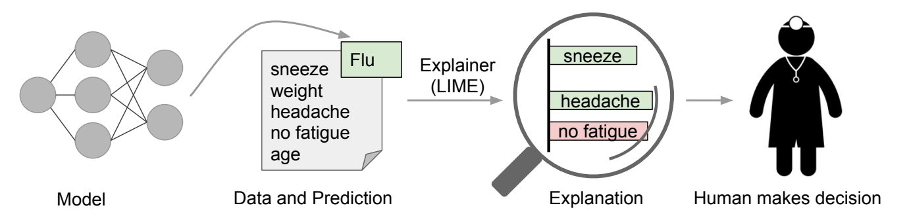
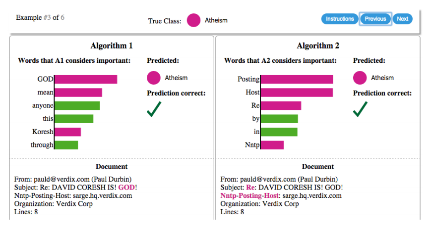
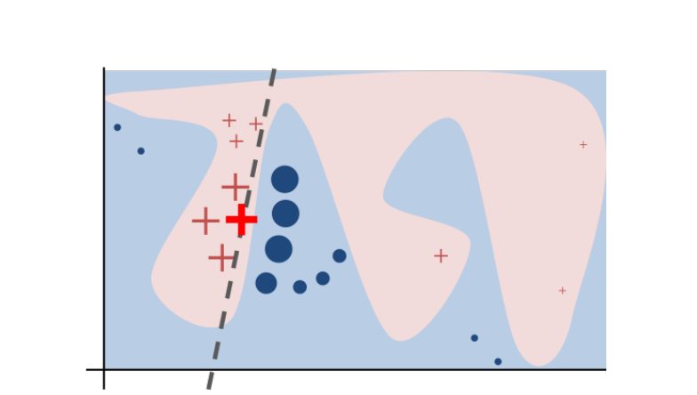
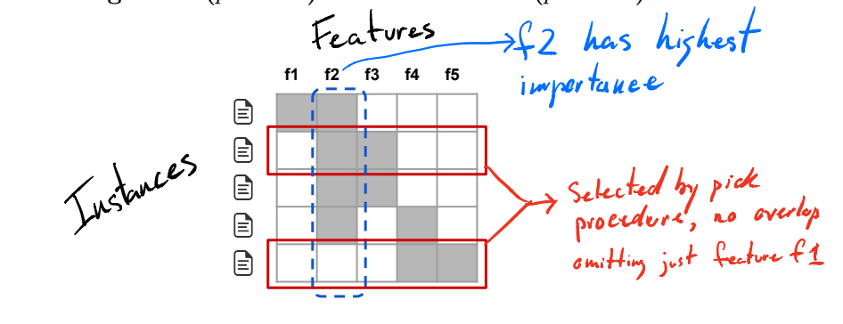
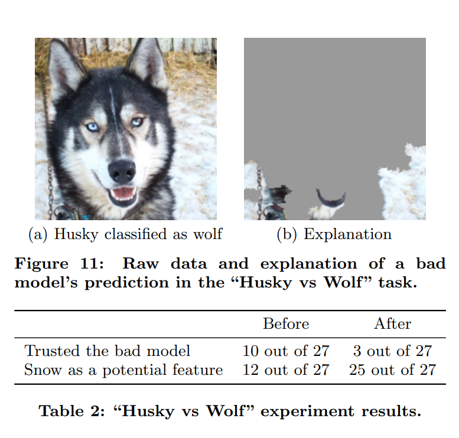
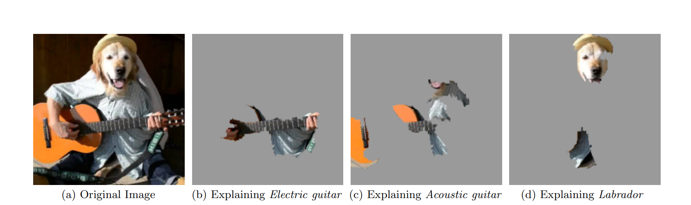

# **Introduction to LIME**
Trust is finicky. It can be either the hardest thing to gain, or the easiest. Regardless of how it is given, it is fragile. It's imperative to be able properly assess the quality of trust of something before it can be used on others to weight decisions, both big and small. Machine learning models that are being developed and released out into the world every day, focusing on accuracy, efficiency, speed, etc. 

An output at a superficial glance can seems to satisfy the criteria it was designed to tackle. What is the *reasoning* behind the output, and should you take action if the prediction or the model is nebulous? There are such strides to take the human element out of the immediate picture, however at the end of the line it's humans themselves that will use these classifiers as tools or embedding models in other products. Users the the judge and jury, and if the trust is not there, as convenient as it may be, they will not use it.

Trusting A Prediction | Trusting A Model
----------------------|------------------
Can an indvidual prediction be trusted to act on it. Making a blind decision, as good as intentions are, can be calamitous|Can the model behave reasonably when deployed. There are a variety of testing datasets out there to measure accuracy, but a model being fed real-world data can fall far from the goal the model is used for.
|

The better a model can outline this for the user to see, the more the user takes comfort in using it. Here is where *Local Interpretable Model-agnostic Explanation* (LIME) comes in. It's goal is to identify an *interpretable* model over the *interpretable* representation that is *locally* faithful to the classifier. It shines a light into any black box model.

# **Explanations**
* *LIME* Cxplains the prediction of any classifier in a lucid and interpretable manner by using an interpretable model on a local scale.
    * ## **Figure 1**:
        

        * A model predicts that a patient has the flu, and LIME highlights the symptoms in the patient’s history that led to the prediction. Sneeze and headache are portrayed as contributing to the “flu” prediction, while “no fatigue” is evidence against it. With these, a doctor can make an informed decision about whether to trust the model’s prediction.
    * ## **Figure 2**:
        

        * Competing classifiers are trying to determine if a document is about “Christianity” or “Atheism”. The bar chart represents the importance given to the most relevant words, also highlighted in the text. Color indicates which class the word contributes to (green for “Christianity”, magenta for “Atheism”).
        * Data models can go wrong. It can suffer from:
            * *Data Leakage*: Unintentional leakage of signal into training and validation data that would not appear when deployed. This gives a increase in accuracy that does not reflect honestly. For the example above, using the explainations, we can see that Algorithm 2 is more accurate, but it performs much worse than Algorithm 1.
            * *Dataset Shift*: Situation where training data is different from test data. Explanations help convert a untrustworthy model to a trustworthy one (removing data or changing training data).

* *SP-LIME*: Chooses a set of instances with explanations to evaluate trust of the model by the use of submodular optimization.

* *Iterpretability*: A small amount of digestible features as an explanation.
    * For text classification, this is a binary (0 or 1) representation of the presence (binary value 1) or absence (binary value 0) of a word.
    * For image classification, this may be a binary representation of the presence (binary value 1) or absence (binary value 0) of a adjacent patch of similar pixels.

* *Locality*: Unless there is a complete description of a model, faithfulness is impossible to achieve. Therefore we look into the vicinity of the predicted instance and how the model behaves in this vicinity.

* *Model-Agnostic*: There are models that are desinged to be interpretable, however the explainer should be able to explain *any* model.

* *Explanation*: A small list of symptoms with relative weight, which can contribute to prediction or have evidence against it. 

# **How LIME Works**:
1. Begin with finding a model that can present visual or textual artifacts to the user.
    * The domain of this model has to be binary.
2. Not all models can be easily interpretable, so we have to measure the complexity of the model and look locally. Examples: 
    * Complexity of decision trees may be the depth of the tree.
    * Complexity of linear models may be the number of non-zero weights.
3. We must finda measure of unfaithfulness of the model by:
    * How the model approximates the probability that the instance being explained belongs to a certain class.
    * A proximity measure to create a locality around the instance being explained and randomly chosen instances.
        * These randomly chosen instances create a perturbed sample set.
        * We then pick however many features describing the model outcome.
        * A simpler model is fitted to our sample set.
        * Weights from the simpler local model creates an explanation.

# **LIME In Action**:

* Looking at the entire example, the pink and blue are representations of the decision function of the black box model. This is ignored and instead settle on local section where a linear model could be used.
    * The bold red cross is the instance being explained. LIME then samples instances with productions using the decision function, and weights these samples using the instance being explained.
    * This gives us the dotted line which represents the locally faithful learned explanation. 

# **How SP-LIME works**:
* We can evaluate a global understanding of a model by explaining a set of individual instances.
    * In the case of images, there needs instances that can be compared across super-pixels in various images (like color histograms).
* These set of instances must be selected wisely, there needs to be a focus on the patience and time constraints that humans have.
    * Taking from the set of instances, the *pick step* is the task of the user inspecting instances they have the patience and time for.
* With the explanations for a set of instances, a explanation matrix is constructed.
    * It's a representation of the local importance of the interpretable components for each instance.
    * Features that explain many different instances are more imporant.

    

    * Note that the set of explanations must not be redundant and avoid overlap. We need to maximize seeing new features as much as possible.
    * This set that achieves the balance of highest coverage while being below the patience/time threshold of the user is known as the *submodular pick*

# **Fallacy Of High Accuracy**
## **Improper**

An intentionally mistrained classifier, to highlight that artifacts of data collection can twist classifiers, and apply it to a human set of testers. It was designed to highlight snow as a separator between a classification of Huskies vs Wolves. All the pictures of wolves had snow in it, the husky training subset had no snow.The result is the classifier gave a high accuracy result.

The user is asked three questions:
1. Do they trust this algorithm to work well in the real world.
2. Explain why
3. How is the algorithm distingushing these photos.

These set of questions are asked once more after the explanation is revealed, and the results are shown in the figure above. 

## **Proper**

In contrast we have classification prediction by Google's inception model. While (b) is incorrect, it builds trust, as in the context, it's a *reasonable* conclusion.

# **Conclusion**
While we as a society move forward towards a world of using computers to optimize and aid our lives, we must never forget that effective human interaction is still the final gate that must be passed before it's used for decision making. In both text and image domain, LIME and SP-LIME while created by machine learning experts help gain insight into how the maching works so non-expert users can make decisions.

Trust is the most important criteria here that must be handled with utmost sensitivity, and the better we can boost and optimize that, the better we can move even farther into the future.
