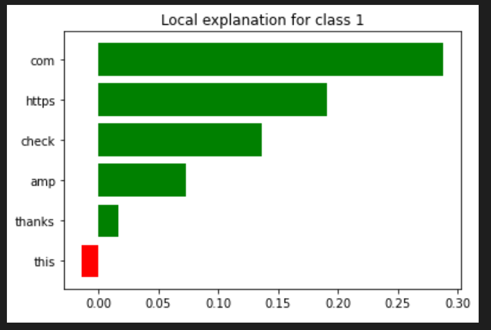
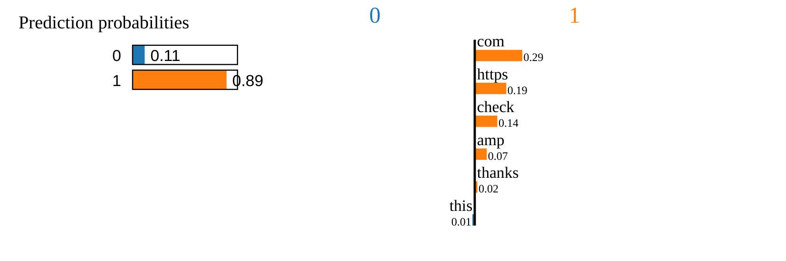
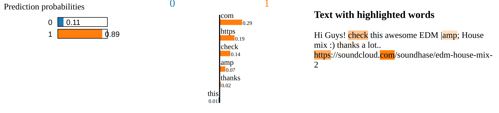

# **Task 4: Tubespam Explainer for [Task 3](https://github.com/calioki/301project/blob/main/Task2_dvd_reviews.ipynb)**
## By Franco Guerra for CS301-102
As opposed to part 2, where the data handled was in similar structure to an XML document (review extension), the youtube spam content was given as a csv file. The specific csv file used for part 3 is *Youtube02-KatyPerry.csv*. The process was similar, except *pandas* was used to import the data from the csv. To gut out the actual comments and their respective labels, I used iloc, which is a integer-location based indexing for selection by position. The slice in the first index collects the values, and the integer in the second index is where the values are extracted from.*

Using the vectorizer, the *fit_transform* was used to scale the data and develop those scaling parameters. 
* *fit* calculates mean and variance of each feature.
* *transform* converts all features using the fit created.

Once we split the matrices into random train and tests subsets, *random forests* was used to classify the features. Predicting with *x_test*  gave us a f1 score of *0.9090909090909091*
* Where f1 score is a measure of the model's accuracy on the given dataset, used to evaluate binary classifcation systems. The f1 score ranges between 0.0 and 1.0 In this case it is:
    * *SPAM*: Binary value of 1
    * *HAM*: Binary value of 0

# **Explaining predictions using lime**
To utilize random forests on the raw documents, we needed to vectorize the data given in order to provide an optimal model. However, LIME explainers assume our classifier process raw data. We utilize sklearn's *pipeline* to automate the workflow to concatenate transformers. 

For our prediction probability of the data we are given:
* **[[0.03 0.97]]**
    * Here, we have a prediction probability of 0.03 for HAM (Binary 0) and 0.97 for SPAM (Binary 1) at this locality.

The classifier got the chosen isntance correctly:

    Document id: 25

    Probability(SPAM) = 0.886

    True class: 1

After creating the explainer object, an explanation is generated with at most 6 features from the test set. The weigheted features are below:
    [('com', 0.28751501111075173),

    ('https', 0.19063684245209306),

    ('check', 0.13658517280918755),

    ('amp', 0.07305369686124286),

    ('thanks', 0.016225453198680663),

    ('this', -0.014025299112468862)

The above features are a linear model within the vicicinty of the given test example. It approximates the behavoir of the random forest classifer. Removing *thanks* and *this* did not afffect the prediction however.

## **Matplotlib barplot for features:**

* Looking at the plot we can see why there was no change in the prediction by removing the unecessary words. *thanks* is given a very small importance, while *this* is given as evidence against the sample being SPAM.
* Looking at the top 3 gives us very strong evidence that the classifier is working correctly in it's locality. 
    * *com* is caught as it is a suffix for website spam in comments.
    * *http* is self explanatory, a prefix for website spam.
    * *check* is a bit more ambigious, but for casual conversation in comments, *check* is usually followed by 
    "it/this out!". So while it is not concrete, it is a reasonable argument for SPAM.

## **Final Visualization**

* Above is the visualization of the original chosen raw text, with an overlay of explanations. 
